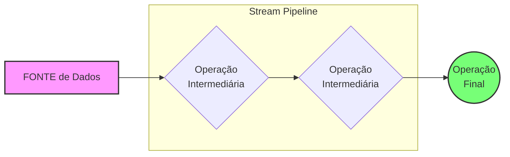

# Dicas Avançadas - Java: Lambdas e Streams

## 1. Interfaces Funcionais do Java (`java.util.function`)

No Java, toda Expressão Lambda deve ser compatível com uma **Interface Funcional** (uma interface com apenas um método abstrato). Embora possamos criar nossas próprias interfaces (como a `ICalculadora`), o Java já oferece um conjunto de interfaces prontas para cobrir 99% dos casos.

### Quando usar?

Sempre que você precisar de uma operação comum (somar, filtrar, transformar), verifique se já existe uma interface pronta no pacote `java.util.function`. Isso evita poluir o projeto com arquivos de interface desnecessários.

### Principais exemplos:

| Interface           | Assinatura do Método                  | Descrição                                                            |
| :------------------ | :------------------------------------ | :------------------------------------------------------------------- |
| `IntBinaryOperator` | `int applyAsInt(int left, int right)` | Recebe dois inteiros e retorna um inteiro (ex: soma, multiplicação). |
| `Predicate<T>`      | `boolean test(T t)`                   | Recebe um valor e retorna um booleano (usado em filtros).            |
| `Consumer<T>`       | `void accept(T t)`                    | Recebe um valor e não retorna nada (ex: `System.out.println`).       |
| `Function<T, R>`    | `R apply(T t)`                        | Recebe um tipo T e transforma em um tipo R.                          |

### Exemplo Prático:

Em vez de criar `ICalculadora`, você poderia usar `IntBinaryOperator`:

```java
import java.util.function.IntBinaryOperator;

// Declaração da lambda usando interface nativa
IntBinaryOperator multiplicador = (x, y) -> x * y;

// Utilização (o método chama-se applyAsInt)
int resultado = multiplicador.applyAsInt(10, 5);
```

> [!TIP]
> Use interfaces nativas sempre que possível para manter seu código idiomático e reduzir a complexidade do projeto.

## 2. A Regra de Ouro das Lambdas

> [!IMPORTANT]
> Uma interface só pode ser usada com **Lambdas** se ela tiver **exatamente um método abstrato**.

Por isso usamos a anotação `@FunctionalInterface`. Ela serve como um "segurança": se você tentar adicionar um segundo método, o Java vai gerar um erro de compilação imediatamente.

**Por que isso acontece?**
A lambda `(x, y) -> x * y` é uma implementação "cega". Se a interface tiver dois métodos (ex: `multiplicacao` e `isPrimo`), o compilador não saberia qual dos dois a lambda está tentando implementar.

### Como resolver se precisar de mais métodos?

1. **Crie interfaces separadas**: Cada uma com sua responsabilidade (ex: `ICalculadora` para cálculos e `IVerificador` para `isPrimo`).

## 3. Visualizando o Pipeline de Streams 🌊

Estudar Streams de forma visual facilita entender que os dados **fluem** através de um cano (pipeline). Imagine uma linha de produção:

### O Modelo Mental do Pipeline



### 🧠 Como o Java "Pensa":

1.  **FONTE**: Onde tudo começa (ex: `List.stream()`).
2.  **OPERAÇÕES INTERMEDIÁRIAS**: Transformam o fluxo, mas **não executam nada** ainda (são preguiçosas/lazy). Elas sempre retornam um novo Stream.
    - `filter()` -> Escolhe quem passa.
    - `map()` -> Transforma quem passa.
    - `sorted()` -> Organiza a fila.
3.  **OPERAÇÃO FINAL**: O "botão de ligar". Só quando ela é chamada é que os dados realmente começam a passar pelo filtro e pela transformação.
    - `collect()` -> Guarda o resultado.
    - `forEach()` -> Executa uma ação (imprimir).

### Desenho do Fluxo de Execução

Imagine a lista `[1, 2, 3, 4]` passando por um filtro de pares e um dobro:

```text
Entrada: [ 1,  2,  3,  4 ]
           |   |   |   |
 filter:  [x] [2] [x] [4]  <-- Só o 2 e 4 passam pelo filtro
               |       |
    map:      [4]     [8]  <-- 2 vira 4, 4 vira 8
               |       |
collect:      [ 4, 8 ]     <-- Resultado Final
```

> [!TIP]
> **Performance**: Como as Streams são preguiçosas, o Java pode otimizar o fluxo. Se você usar um `.limit(5)`, ele para de processar a lista assim que encontrar os primeiros 5, mesmo que a lista tenha 1 milhão de itens!
