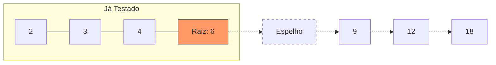

# Por que testar apenas até a Raiz Quadrada? 🧮

A regra da raiz quadrada é um dos "pulos do gato" mais famosos da computação e da matemática para lidar com números primos. Vamos entender o motivo de forma visual e simples.

## 1. O Segredo: Divisores andam em PARES

Sempre que um número não é primo, ele pode ser formado pela multiplicação de dois outros números (seus divisores).

**Exemplo com o número 36:**
Vamos listar todas as multiplicações que resultam em 36:

- 1 × 36 = 36
- 2 × 18 = 36
- 3 × 12 = 36
- 4 × 9 = 36
- **6 × 6 = 36** (Raiz quadrada!)
- 9 × 4 = 36
- 12 × 3 = 36
- 18 × 2 = 36
- 36 × 1 = 36

## 2. O Efeito Espelho (A Raiz Quadrada)

Repare na lista acima. Após o **6 × 6**, os números apenas se repetem em ordem inversa (9×4 é o inverso de 4×9).

A raiz quadrada de 36 é **6**.

- Se o 36 tivesse um divisor maior que 6 (como o 9), ele obrigatoriamente teria um par **menor** que 6 (no caso, o 4).
- Se você já testou todos os números até 6 e não achou nenhum divisor, não adianta testar o 9, 12 ou 18, porque os parceiros deles seriam números menores que 6, que você **já testou**!



## 3. Na Prática: Ganho de Velocidade

Se você quiser saber se **1.000.001** é primo:

- **Sem a regra**: Seu código faz **1 milhão** de voltas no `for`.
- **Com a regra**: A raiz quadrada é aproximadamente **1000**. Seu código faz apenas **1 milhar** de voltas.

**O seu código ficaria assim:**

```java
// Em vez de i < x
for (int i = 3; i <= Math.sqrt(x); i += 2) {
    if (x % i == 0) return false;
}
```

> [!NOTE]
> Essa otimização é a diferença entre um programa que trava o computador e um que responde instantaneamente quando lidamos com grandes volumes de dados!
